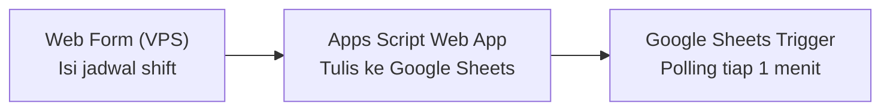
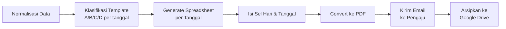

# Jurnal Siaga Generator

> Otomatisasi laporan dinas bulanan — dari pengisian manual per-shift jadi alur otomatis penuh: input jadwal → klasifikasi template → generate spreadsheet → PDF → email → arsip.


---

## Daftar Isi

- [Ringkasan](#-ringkasan)
- [Problem](#-problem)
- [Solution](#-solution)
- [Result](#-result)
- [Cara Kerja](#%EF%B8%8F-cara-kerja)
- [Screenshot](#-screenshot)
- [Struktur Folder](#%EF%B8%8F-struktur-folder)
- [Dokumentasi Teknis Lengkap](#-dokumentasi-teknis-lengkap)
- [Keamanan](#-keamanan)
- [Author](#-author)
- [Lisensi](#-lisensi)

---

## 📌 Ringkasan

Sistem ini mengotomatisasi pengisian **Jurnal Siaga** — log kegiatan harian personel jaga milik klien (unit siaga/rescue) — yang wajib diisi setiap bulan untuk setiap tanggal shift, mengikuti format resmi instansi (7 baris kegiatan per tanggal, isinya berbeda tergantung kombinasi shift & hari).

| Aspek | Sebelum | Sesudah |
| :--- | :--- | :--- |
| **Pengisian jurnal** | Manual, disalin per tanggal setiap bulan | Isi form sekali → seluruh tanggal ter-generate otomatis |
| **Konfigurasi ID spreadsheet/tab** | Hardcode terpisah di 5 node | Terpusat, dicocokkan via `gid` |
| **Dokumentasi logika bisnis** | Sempat hilang total saat *instance* n8n lama hilang | Terdokumentasi penuh di `workflows/jurnal-siaga-generator.md` |
| **Status** | Manual | Otomatis |

**Status:** Rebuild dari sistem yang sebelumnya sempat berjalan di produksi (dibangun mandiri, sempat hilang karena *instance* n8n hilang tanpa dokumentasi). Saat ini dalam tahap penyelesaian deployment ulang: n8n self-hosted + form input kustom di VPS sendiri.

---

## 🧠 Problem

### Masalah yang Dihadapi

| Masalah | Detail |
| :--- | :--- |
| **Pengisian Manual Berulang** | Jurnal siaga bulanan diisi manual per tanggal shift, mengikuti format baku 7 baris kegiatan dengan jam yang sudah ditentukan — repetitif dan memakan waktu setiap bulan. |
| **Dokumentasi Hilang** | Otomasi versi pertama (n8n self-hosted, dibangun mandiri) sempat berjalan di produksi, tapi *instance*-nya hilang tanpa dokumentasi tertulis — logika klasifikasi dan aturan bisnis nyaris ikut hilang. |
| **Konfigurasi Tersebar** | ID *spreadsheet* dan *gid* tab template di-*hardcode* terpisah di 5 node berbeda — sekali ada perubahan, gampang lupa update semua tempat. |
| **Pola Terlalu Template** | Jam nyala/matikan lampu di jurnal selalu identik persis setiap minggu — berisiko dicurigai "terlalu template" saat audit. |
| **Tanpa Notifikasi Gagal** | Kalau workflow gagal di tengah jalan, tidak ada pemberitahuan — baru ketahuan saat klien menanyakan laporan yang belum masuk. |
| **Operasi Khusus Tidak Terwadahi** | Kejadian operasi penyelamatan nyata (jarang, tapi terjadi) belum punya jalur input manual yang rapi tanpa merusak format baku 7 baris. |
| **Bug Tersembunyi di Form Lama** | Satu nama kolom hasil isian Google Form punya karakter *newline* tak terlihat di ujungnya — bisa diam-diam mematahkan pemetaan data kalau tidak dicek ulang. |

### Dampak

- Waktu terbuang untuk kerja repetitif setiap bulan
- Risiko kehilangan konteks/logika bisnis kalau infrastruktur hilang lagi
- Rentan error senyap (ID salah, kolom salah) yang baru ketahuan belakangan

---

## 💡 Solution

### Arsitektur

| Lapisan | Teknologi | Peran |
| :--- | :--- | :--- |
| **Input** | Custom web form (HTML/JS statis, host sendiri di VPS) | Terima isian jadwal shift bulanan |
| **Jembatan** | Google Apps Script Web App | Terima POST dari form, tulis ke Google Sheets |
| **Data** | Google Sheets | Sheet respons + *spreadsheet master* 4 tab template (A/B/C/D) |
| **Eksekusi** | n8n (self-hosted, VPS, Docker + Caddy) | Klasifikasi template, generate jurnal, kirim & arsipkan |
| **Output** | Google Drive + Email | PDF arsip & hasil ke pemohon |

### Alur Kerja

**Tahap input:**



**Tahap pemrosesan:**



### Yang Dikerjakan

- **Klasifikasi deterministik** — Code Node JavaScript murni (bukan AI) menentukan template A/B/C/D per tanggal: S2 selalu Template D; S1 dipetakan ke A/B/C sesuai hari. Hasilnya konsisten dan bisa diaudit.
- **Sumber konfigurasi tunggal** — ID *spreadsheet master* dan *gid* tiap tab template disatukan di satu Set Node, menggantikan 5 titik hardcode terpisah.
- **Format baku terjaga** — jumlah baris kegiatan tetap 7 sesuai format resmi instansi, tidak pernah bertambah/berkurang.
- **Jalur override manual** — sheet terpisah `Log Operasi Khusus` untuk mencatat kejadian penyelamatan nyata dan menimpa isi baris tertentu lewat `values:batchUpdate`, tanpa mengubah struktur 7-baris.
- **Form input pengganti** — Google Form diganti custom web form (`web-form/index.html`) yang di-*host* sendiri di VPS (Docker Compose + Caddy), terhubung ke `web-form/Code.gs` yang di-*deploy* sebagai Apps Script Web App. n8n Google Sheets Trigger tidak perlu diubah karena form baru menulis ke tab respons yang sama persis.
- **Perbaikan bug integrasi** — dua bug baru ditemukan & diperbaiki saat integrasi: (1) pencarian sheet berdasarkan *nama* tidak cocok dengan nama asli bawaan Google Form, menyebabkan data nyasar ke tab kosong — diperbaiki dengan mencocokkan berdasarkan **gid**; (2) penulisan baris berbasis nama header (bukan urutan tetap), termasuk menangani bug *trailing newline* di header lama.

### Teknologi yang Digunakan

| Teknologi | Fungsi |
| :--- | :--- |
| **n8n** | Workflow orchestration, klasifikasi & eksekusi deterministik |
| **Google Sheets API** | Baca data form & tulis hasil klasifikasi |
| **Google Drive API** | Arsip PDF jurnal hasil generate |
| **Google Apps Script** | Web App penghubung form kustom ke Sheets |
| **JavaScript** | Logika klasifikasi template & validasi form |
| **Gmail (n8n Email node)** | Kirim jurnal PDF ke pengaju |
| **Docker Compose + Caddy** | Hosting form kustom di VPS sendiri dengan HTTPS otomatis |

---

## 📊 Result

- Pengisian jurnal bulanan yang tadinya manual per-tanggal kini otomatis penuh: isi form sekali → jurnal per tanggal ter-generate, ter-konversi PDF, terkirim email, dan terarsip ke Drive tanpa campur tangan lanjutan.
- Rebuild kali ini terdokumentasi penuh — risiko kehilangan logika bisnis kalau infrastruktur hilang lagi jauh berkurang.
- Kelas bug "salah ID/salah tab" yang jadi biang error di versi lama dihilangkan lewat sentralisasi konfigurasi dan pencocokan berbasis gid + nama header.
- Form input kini 100% terkontrol sendiri (desain, domain, validasi) — lepas dari batasan tampilan Google Form.

---

## 🛠️ Cara Kerja

### Bagi Pengguna

1. Buka form (`web-form/index.html`, di-host di domain sendiri)
2. Pilih bulan & tahun
3. Pilih shift awal bulan ini (S1 Pagi / S2 Malam)
4. Klik tanggal-tanggal shift di kalender
5. Isi email pengaju
6. Klik Kirim
7. Tunggu email — jurnal PDF per tanggal otomatis dikirim & diarsipkan ke Drive

### Bagi Developer

1. Clone repository ini
2. Salin `.env.example` ke `.env`, isi kredensial & ID yang dibutuhkan
3. Deploy `web-form/Code.gs` sebagai Google Apps Script Web App (`Execute as: Me`, `Who has access: Anyone`)
4. Isi `APPS_SCRIPT_URL` di `web-form/index.html` dengan URL deployment, lalu host file itu di VPS
5. Import `jurnal-siaga-n8n-workflow.sanitized.json` ke n8n, sesuaikan credential
6. Aktifkan workflow

---

## 📸 Screenshot

> Tempatkan file gambar di `assets/` dengan nama berikut, gambar akan otomatis tampil di sini.

| Workflow n8n | Klasifikasi Template |
| :--- | :--- |
|  |  |

| Form Desktop | Form Mobile |
| :--- | :--- |
|  |  |

| Sheet Respons | Contoh PDF Jurnal |
| :--- | :--- |
|  |  |

---

## 🗂️ Struktur Folder

```
.
├── workflows/       # Dokumentasi SOP (Markdown) — spesifikasi teknis & alur kerja
├── web-form/        # Form input kustom: Code.gs (Apps Script Web App) + index.html (statis, di-host di VPS)
├── tools/           # Skrip Python deterministik untuk eksekusi pendukung
├── assets/          # Screenshot & media dokumentasi (case study)
├── .env.example     # Template variabel lingkungan (tanpa nilai asli)
├── .tmp/            # File sementara (diabaikan oleh Git)
├── secrets/         # File mentah berisi kredensial/ID asli (diabaikan oleh Git)
├── .gitignore       # Daftar file/folder yang tidak di-commit
└── README.md        # Dokumen ini
```

---

## 📚 Dokumentasi Teknis Lengkap

- **Spesifikasi teknis & aturan klasifikasi lengkap**: [`workflows/jurnal-siaga-generator.md`](workflows/jurnal-siaga-generator.md)
- **Workflow n8n versi tersanitasi** (ID diganti placeholder, aman untuk publik): [`jurnal-siaga-n8n-workflow.sanitized.json`](jurnal-siaga-n8n-workflow.sanitized.json)
- **Backend & source form input kustom**: [`web-form/`](web-form/)

---

## 🔒 Keamanan

File `.env`, direktori `secrets/`, dan seluruh berkas berisi kredensial telah dikonfigurasi di dalam `.gitignore`.
Dengan demikian, repositori ini aman untuk dipublikasikan sebagai portfolio tanpa risiko membocorkan:

- ID spreadsheet
- Alamat email/nomor telepon
- Kunci API atau token akses apa pun

---

## 👤 Author

**Agung Tri Mahmudi**

- Email: agungtrimahmudi.it@gmail.com
- GitHub: [github.com/Agungtrimahmudi-automation](https://github.com/Agungtrimahmudi-automation)
- LinkedIn: [linkedin.com/in/agung-tri-mahmudi](https://linkedin.com/in/agung-tri-mahmudi)

---

## 📄 Lisensi

**All Rights Reserved** — lihat [`LICENSE`](LICENSE). Hak cipta sepenuhnya dimiliki oleh Agung Tri Mahmudi. Repositori ini dipublikasikan untuk keperluan portfolio dan referensi; tidak ada izin untuk menyalin, memodifikasi, atau mendistribusikan ulang tanpa izin tertulis dari pemilik.
