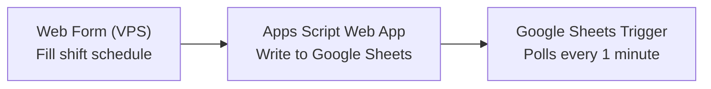
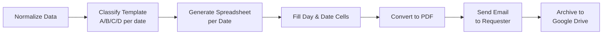

# Jurnal Siaga Generator

> Automating a monthly duty report: from manual per-shift filling to a fully automated flow: input schedule to template classification to spreadsheet generation to PDF to email to archive.


---

## Table of Contents

- [Overview](#-overview)
- [Problem](#-problem)
- [Solution](#-solution)
- [Result](#-result)
- [How It Works](#%EF%B8%8F-how-it-works)
- [Screenshot](#-screenshot)
- [Folder Structure](#%EF%B8%8F-folder-structure)
- [Full Technical Documentation](#-full-technical-documentation)
- [Security](#-security)
- [Author](#-author)
- [License](#-license)

---

## 📌 Overview

This system automates filling out the **Jurnal Siaga**: a daily activity log for the client's on-duty personnel (an emergency response/rescue unit) that must be filled in every month for every shift date, following the organization's official format (7 activity rows per date, with content that varies by shift and day combination).

| Aspect | Before | After |
| :--- | :--- | :--- |
| **Journal filling** | Manual, copied per date every month | Fill the form once, every date is generated automatically |
| **Spreadsheet/tab ID config** | Hardcoded separately across 5 nodes | Centralized, matched via `gid` |
| **Business logic documentation** | Lost entirely when the old n8n instance was lost | Fully documented in `workflows/jurnal-siaga-generator.md` |
| **Status** | Manual | Automated |

**Status:** Rebuild of a system that previously ran in production (built independently, later lost when the n8n instance disappeared without documentation). Currently finishing redeployment: self-hosted n8n plus a custom input form on my own VPS.

---

## 🧠 Problem

### The Challenges

| Problem | Detail |
| :--- | :--- |
| **Repetitive manual filling** | The monthly duty journal was filled in manually per shift date, following a fixed 7-activity-row format with predetermined times: repetitive and time-consuming every month. |
| **Lost documentation** | The first version of the automation (self-hosted n8n, built independently) ran in production for a while, but the instance was lost with no written documentation, nearly taking the classification logic and business rules with it. |
| **Scattered configuration** | The spreadsheet ID and template tab `gid` were hardcoded separately across 5 different nodes: one change meant an easy-to-miss update in every location. |
| **Pattern too templated** | The lights-on/lights-off times in the journal were identical every single week, risking suspicion of being "too templated" during an audit. |
| **No failure notification** | If the workflow failed midway, there was no alert; it was only noticed when the client asked about a report that never arrived. |
| **No path for special operations** | Real rescue operations (rare, but they happen) had no clean manual input path that wouldn't break the fixed 7-row format. |
| **Hidden bug in the old form** | One column name from the Google Form responses had an invisible trailing newline character: something that could silently break the data mapping if left unchecked. |

### Impact

- Time wasted on repetitive work every month
- Risk of losing business context/logic if the infrastructure is lost again
- Vulnerable to silent errors (wrong ID, wrong column) that only surface later

---

## 💡 Solution

### Architecture

| Layer | Technology | Role |
| :--- | :--- | :--- |
| **Input** | Custom web form (static HTML/JS, self-hosted on a VPS) | Collects the monthly shift schedule |
| **Bridge** | Google Apps Script Web App | Receives the form POST, writes to Google Sheets |
| **Data** | Google Sheets | Response sheet plus a master spreadsheet with 4 template tabs (A/B/C/D) |
| **Execution** | n8n (self-hosted, VPS, Docker + Caddy) | Template classification, journal generation, sending, and archiving |
| **Output** | Google Drive + Email | Archived PDFs and results sent to the requester |

### Workflow

**Input stage:**



**Processing stage:**



### What Was Built

- **Deterministic classification**: a pure JavaScript Code Node (no AI) determines the A/B/C/D template per date: S2 is always Template D; S1 maps to A/B/C depending on the day. The result is consistent and auditable.
- **Single source of configuration**: the master spreadsheet ID and each template tab's `gid` are unified into one Set Node, replacing 5 separate hardcoded points.
- **Fixed format preserved**: the number of activity rows stays at 7 per the official format, never more or fewer.
- **Manual override path**: a separate `Log Operasi Khusus` sheet records real rescue events and overwrites specific rows via `values:batchUpdate`, without changing the 7-row structure.
- **Replacement input form**: the Google Form was replaced with a custom web form (`web-form/index.html`) self-hosted on a VPS (Docker Compose + Caddy), connected to `web-form/Code.gs` deployed as an Apps Script Web App. The n8n Google Sheets Trigger needed no changes since the new form writes to the exact same response tab.
- **Integration bug fixes**: two new bugs were found and fixed during integration: (1) sheet lookup by *name* didn't match the raw name Google Form generates, causing data to land in an empty tab, fixed by matching on **gid** instead; (2) row writing by header name (rather than fixed order), including handling a trailing-newline bug in an old header.

### Technologies Used

| Technology | Function |
| :--- | :--- |
| **n8n** | Workflow orchestration, deterministic classification and execution |
| **Google Sheets API** | Reads form data and writes classification results |
| **Google Drive API** | Archives generated journal PDFs |
| **Google Apps Script** | Web App bridging the custom form to Sheets |
| **JavaScript** | Template classification logic and form validation |
| **Gmail (n8n Email node)** | Sends the PDF journal to the requester |
| **Docker Compose + Caddy** | Hosts the custom form on my own VPS with automatic HTTPS |

---

## 📊 Result

- Monthly journal filling that used to be manual per date is now fully automated: fill the form once and the per-date journal is generated, converted to PDF, emailed, and archived to Drive with no further intervention.
- This rebuild is fully documented, greatly reducing the risk of losing business logic if the infrastructure is lost again.
- The "wrong ID/wrong tab" bug class that caused errors in the old version has been eliminated through centralized configuration and gid plus header-name matching.
- The input form is now 100% self-controlled (design, domain, validation), free from Google Form's display limitations.

---

## 🛠️ How It Works

### For Users

1. Open the form (`web-form/index.html`, hosted on my own domain)
2. Select month and year
3. Select the starting shift for the month (S1 Day / S2 Night)
4. Click the shift dates on the calendar
5. Enter the requester's email
6. Click Submit
7. Wait for email: the per-date PDF journal is sent automatically and archived to Drive

### For Developers

1. Clone this repository
2. Copy `.env.example` to `.env` and fill in the required credentials and IDs
3. Deploy `web-form/Code.gs` as a Google Apps Script Web App (`Execute as: Me`, `Who has access: Anyone`)
4. Fill in `APPS_SCRIPT_URL` in `web-form/index.html` with the deployment URL, then host that file on a VPS
5. Import `jurnal-siaga-n8n-workflow.sanitized.json` into n8n and adjust the credentials
6. Activate the workflow

---

## 📸 Screenshot

> Not available yet. The list of files needed (n8n workflow, desktop/mobile form, response
> sheet, sample PDF) is in [`assets/README.md`](assets/README.md). This section will be filled
> in once the actual screenshot files are placed in `assets/`.

---

## 🗂️ Folder Structure

```
.
├── workflows/       # SOP documentation (Markdown): technical spec and workflow
├── web-form/        # Custom input form: Code.gs (Apps Script Web App) + index.html (static, hosted on a VPS)
├── tools/           # Deterministic Python scripts for supporting execution
├── assets/          # Screenshots and documentation media (case study)
├── .env.example     # Environment variable template (no real values)
├── .tmp/            # Temporary files (ignored by Git)
├── secrets/         # Raw files with real credentials/IDs (ignored by Git)
├── .gitignore       # List of files/folders not committed
└── README.md        # This document
```

---

## 📚 Full Technical Documentation

- **Full technical spec and classification rules**: [`workflows/jurnal-siaga-generator.md`](workflows/jurnal-siaga-generator.md)
- **Sanitized n8n workflow** (IDs replaced with placeholders, safe for the public): [`jurnal-siaga-n8n-workflow.sanitized.json`](jurnal-siaga-n8n-workflow.sanitized.json)
- **Backend and source for the custom input form**: [`web-form/`](web-form/)

---

## 🔒 Security

The `.env` file, the `secrets/` directory, and every file containing credentials are configured in `.gitignore`.
This makes the repository safe to publish as a portfolio piece without risk of leaking:

- Spreadsheet IDs
- Email addresses/phone numbers
- Any API keys or access tokens

---

## 👤 Author

**Agung Tri Mahmudi**

- Email: agungtrimahmudi.it@gmail.com
- GitHub: [github.com/Agungtrimahmudi-automation](https://github.com/Agungtrimahmudi-automation)
- LinkedIn: [linkedin.com/in/agung-tri-mahmudi](https://linkedin.com/in/agung-tri-mahmudi)

---

## 📄 License

**All Rights Reserved**, see [`LICENSE`](LICENSE). Copyright is fully retained by Agung Tri Mahmudi. This repository is published for portfolio and reference purposes; no permission is granted to copy, modify, or redistribute it without the owner's written consent.
